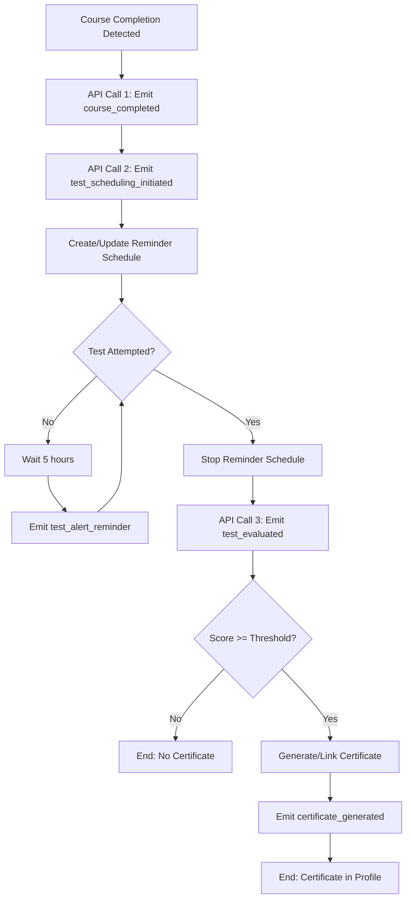

# Launch Pipeline Node-Based Workflow

This document maps the implemented app flow to node-based orchestration engines (Node.js workflow runners, Azure Data Factory, Airflow).

## Implemented Event Types

- `course_completed`
- `test_scheduling_initiated`
- `test_alert_reminder`
- `test_evaluated`
- `certificate_generated`

## Node Graph (Logical)



## Node Definitions

### N1: Course Completion Trigger
- **Trigger**: User completes course tutorial (5 hours / completion flag).
- **Source route**: `POST /api/domain/<domain_id>/course/<course_link_id>/progress`
- **Condition**: First transition to completed state.
- **Output**: Completion context (`user`, `domain`, `course`, `completed_at`).

### N2: Launch Notify - Completion (API Call 1)
- **Action**: Send `course_completed` to Launch pipeline.
- **Purpose**: Pipeline records and propagates course completion.

### N3: Launch Notify - Test Scheduling (API Call 2)
- **Action**: Send `test_scheduling_initiated`.
- **Purpose**: Start test scheduling state in pipeline.

### N4: Reminder Scheduler Init
- **Action**: Create/update persistent schedule entry.
- **Persistence**: `DomainTestAlertSchedule` table.
- **Initial next run**: `course_completed_at + 5 hours`.

### N5: Reminder Loop Controller
- **Condition**: Continue while test not attempted.
- **Loop interval**: 5 hours.
- **Worker**: Background dispatcher checks due schedules.

### N6: Reminder Emit
- **Action**: Send `test_alert_reminder` every 5 hours.
- **Stop condition**: First quiz attempt start or submit.

### N7: Test Attempt Stopper
- **Trigger**:
  - `POST /api/domain/<domain_id>/course/<course_link_id>/quiz/start`
  - `POST /api/domain/<domain_id>/course/<course_link_id>/quiz/submit`
- **Action**: Mark reminder schedule inactive.

### N8: Test Evaluation (API Call 3)
- **Trigger**: Quiz submit.
- **Action**: Evaluate score and emit `test_evaluated`.
- **Threshold**: Configurable (`QUIZ_PASS_THRESHOLD`, default `70`).

### N9: Certificate Generation Node
- **Condition**: Score >= threshold.
- **Action**: Generate (or reuse existing) certificate and link to profile.
- **Persistence**: `DomainCertificate` table.

### N10: Launch Notify - Certificate
- **Action**: Send `certificate_generated`.
- **Purpose**: Communicate final achievement through Launch pipeline.

## Transition Rules

1. `N1 -> N2` when completion becomes true for the first time.
2. `N2 -> N3` immediately after completion notification.
3. `N3 -> N4` initialize recurring scheduler state.
4. `N4 -> N5` enter reminder loop.
5. `N5 -> N6` every 5 hours while no test attempt exists.
6. `N6 -> N5` repeat.
7. `N5 -> N7` on first test attempt.
8. `N7 -> N8` on quiz submit with answers.
9. `N8 -> N9` only if `passed == true`.
10. `N9 -> N10` after certificate persistence.

## Event Payload Contracts

### `course_completed`
```json
{
  "user_id": 123,
  "username": "candidate1",
  "email": "candidate@example.com",
  "domain_id": 10,
  "domain_name": "Python",
  "course_link_id": 44,
  "course_title": "Python Basics",
  "completed_at": "2026-02-20T17:30:00Z"
}
```

### `test_scheduling_initiated`
```json
{
  "user_id": 123,
  "domain_id": 10,
  "domain_name": "Python",
  "course_link_id": 44,
  "course_title": "Python Basics",
  "alert_interval_hours": 5,
  "next_alert_at": "2026-02-20T22:30:00Z",
  "active": true
}
```

### `test_alert_reminder`
```json
{
  "user_id": 123,
  "domain_id": 10,
  "course_link_id": 44,
  "course_completed_at": "2026-02-20T17:30:00Z",
  "next_alert_at": "2026-02-20T22:30:00Z",
  "message": "Please attempt your course test."
}
```

### `test_evaluated`
```json
{
  "user_id": 123,
  "username": "candidate1",
  "email": "candidate@example.com",
  "domain_id": 10,
  "domain_name": "Python",
  "course_link_id": 44,
  "course_title": "Python Basics",
  "score": 82,
  "threshold": 70,
  "passed": true,
  "attempted_at": "2026-02-21T01:05:00Z"
}
```

### `certificate_generated`
```json
{
  "user_id": 123,
  "username": "candidate1",
  "email": "candidate@example.com",
  "domain_id": 10,
  "domain_name": "Python",
  "course_link_id": 44,
  "course_title": "Python Basics",
  "certificate_id": 555,
  "certificate_code": "SF-PYBA-12AB34",
  "certificate_title": "Python - Certificate of Completion",
  "score": 82,
  "issued_at": "2026-02-21T01:05:02Z"
}
```

## Runtime/Config Mapping

- `LAUNCH_PIPELINE_URL`: Endpoint receiving all event POSTs.
- `LAUNCH_PIPELINE_TIMEOUT_SECONDS`: HTTP timeout for Launch event calls.
- `TEST_ALERT_INTERVAL_HOURS`: Reminder cadence (default `5`).
- `QUIZ_PASS_THRESHOLD`: Passing threshold for certificate branch (default `70`).

## Engine Mapping Hints

- **Airflow**: model each node as a `PythonOperator` with a `BranchPythonOperator` for threshold/attempt checks.
- **ADF**: use Web activities for API emits, Until activity for reminder loop, If Condition for pass/fail.
- **Node.js workflow**: use queue + delay jobs (5-hour retry) with idempotency key `user_id:domain_id:course_link_id`.

## Idempotency Guidance

- Key: `user_id + domain_id + course_link_id`
- Ensure `course_completed` and `test_scheduling_initiated` are only treated once per completion cycle.
- `certificate_generated` should be upsert-safe (existing certificate reused).
